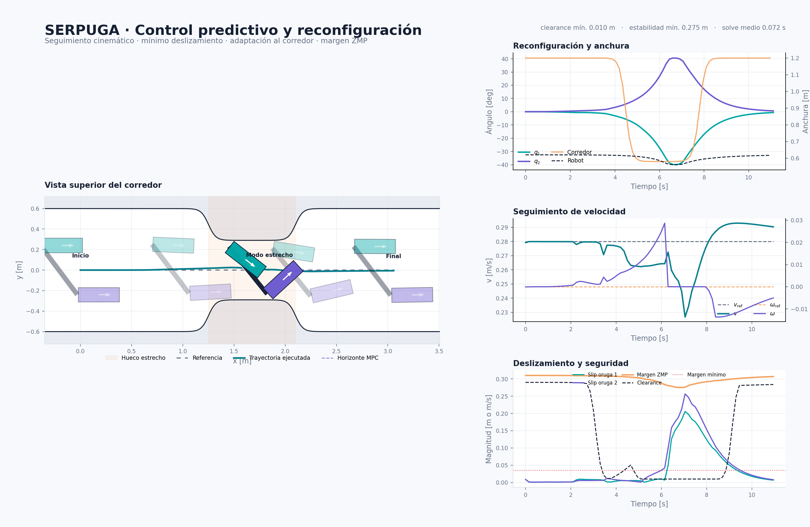

# SERPUGA Control

Prototipo en Python de control predictivo no lineal para un robot formado por
dos orugas reconfigurables. El controlador sigue una trayectoria con referencias
de velocidad lineal y angular, minimiza el deslizamiento, adapta la envolvente
del robot a un corredor estrecho y conserva un margen lateral de estabilidad.



## Qué incluye

- descripción paramétrica de pivotes, huellas, masas y límites de actuación;
- cinemática plana con contribución de `q_dot` cuando el pivote no coincide con
  el centro de la huella;
- cinemática inversa predictiva con `v1`, `v2`, `q1_dot` y `q2_dot`;
- deslizamiento longitudinal, lateral y término de *scrubbing*;
- NMPC de disparo múltiple implementado con CasADi/IPOPT;
- restricciones sobre todos los vértices del robot;
- corredor sintético intercambiable por el futuro estimador láser;
- estabilidad lateral geométrica o mediante ZMP aproximado;
- simulación en horizonte recedente, pruebas y visualizador de diagnóstico.

## Estructura

| Módulo | Función |
|---|---|
| `config.py` | Dimensiones, límites y pesos |
| `robot.py` | Geometría, huellas, CoM y soporte |
| `kinematics.py` | Twist, slip e integración RK4 |
| `trajectory.py` | Referencias y previsualización |
| `corridor.py` | Estimación sintética del espacio libre |
| `nmpc.py` | Formulación y resolución del NMPC |
| `simulation.py` | Bucle cerrado y métricas |
| `visualization.py` | Dashboard del experimento |
| `cli.py` | Ejecución reproducible de escenarios |

La formulación matemática se resume en [`docs/model.md`](docs/model.md).

## Instalación

```bash
python -m venv .venv
source .venv/bin/activate
python -m pip install -e ".[dev]"
```

## Ejecución

Escenario con estrechamiento:

```bash
python -m serpuga_control --scenario gap
```

Seguimiento con velocidad angular no nula y corredor abierto:

```bash
python -m serpuga_control --scenario turn --output artifacts/turn.png
```

La imagen se guarda por defecto en `artifacts/serpuga_visualizer.png`. También
se instala el comando equivalente:

```bash
serpuga-demo --scenario gap
```

## Pruebas

```bash
pytest
```

## Resultado de referencia

Con los parámetros de demostración, el robot empieza a plegarse antes del
hueco, mantiene 10 mm de separación mínima respecto al corredor y recupera la
configuración paralela tras salir. Los resultados exactos dependen del equipo y
se imprimen como JSON al terminar cada ejecución.

## Alcance actual

Este repositorio valida la arquitectura y la optimización cinemática en 2D. No
es todavía un controlador listo para hardware: el twist optimizado se considera
realizable y la estabilidad emplea suelo plano, altura constante y una
aproximación del ZMP. El siguiente nivel deberá introducir dinámica de
actuadores, estimación de estado, incertidumbre del corredor y un modelo
identificado de interacción oruga-terreno.

